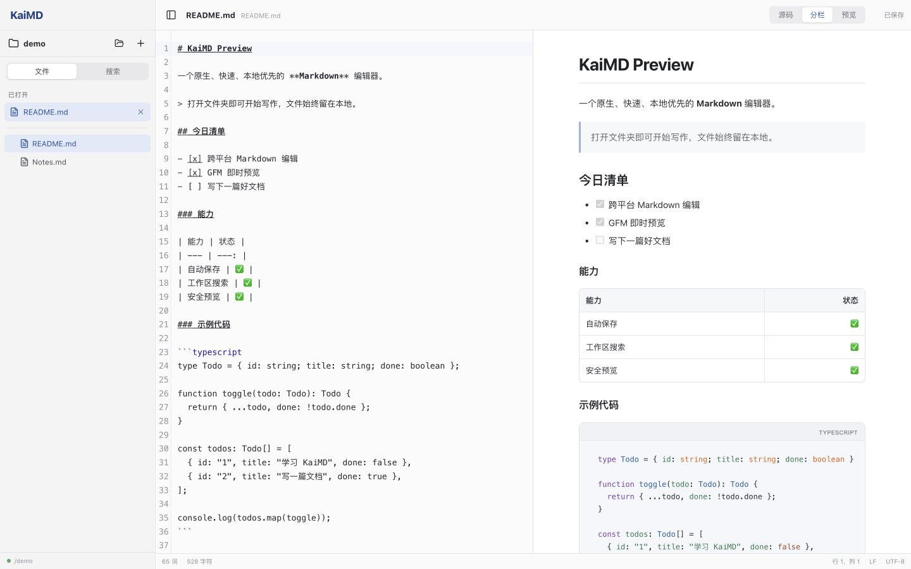

# KaiMD

[English](README.md) | [简体中文](README.zh-CN.md)

[](https://github.com/mason2048/KaiMD/actions/workflows/desktop-ci.yml)
[](https://github.com/mason2048/KaiMD/releases)
[](LICENSE)

KaiMD is an open-source, local-first Markdown editor for Windows and macOS. It
keeps documents on your computer, manages multiple files in one window, and
provides source, split, and preview modes.



> KaiMD is currently an unsigned `0.1.x` alpha. Expect rough edges and keep
> backups of important documents. macOS Gatekeeper and Windows SmartScreen may
> warn about downloaded builds until code signing is introduced.

## Features

- One Tauri 2 application for Windows and macOS
- Markdown files, folder workspaces, file tree, and full-text workspace search
- CodeMirror editor with GitHub Flavored Markdown preview and syntax highlighting
- Readable inline code and fenced blocks with language labels and horizontal scrolling
- 650 ms debounced autosave while preserving UTF-8 BOM and LF/CRLF line endings
- Single-window file handling: opening another Markdown file from the operating
  system adds it to the current sidebar and selects it
- Session restore, secure local-image previews, and source/split/preview shortcuts

## Install an alpha build

Pre-release installers are published on the [Releases page](https://github.com/mason2048/KaiMD/releases)
after manual smoke testing:

- macOS: Universal `.dmg` for Apple Silicon and Intel
- Windows 11 x64: NSIS `.exe` and MSI `.msi`

Published files include `SHA256SUMS.txt`. Alpha builds are not yet notarized or
code-signed; review the release notes before bypassing an operating-system warning.

## Develop locally

Prerequisites:

- Node.js 20
- pnpm 9.15.9 through Corepack
- Rust 1.96.0
- The [Tauri prerequisites](https://v2.tauri.app/start/prerequisites/) for your platform

```bash
cd apps/desktop
corepack enable
pnpm install --frozen-lockfile
pnpm tauri dev
```

Run the release checks:

```bash
cd apps/desktop
pnpm check
pnpm check:version
pnpm licenses:check
pnpm tauri build --no-bundle
```

## Repository layout

```text
apps/desktop/          Cross-platform application (active development)
legacy/macos-native/   Original Swift/AppKit implementation (maintenance mode)
docs/                  Architecture, product screenshots, and design references
scripts/               Repository validation and notice-generation tools
```

See [Architecture](docs/ARCHITECTURE.md), [Roadmap](ROADMAP.md), and
[Changelog](CHANGELOG.md) for more detail.

## Contributing and security

Issues and focused pull requests are welcome. Please read
[Contributing](CONTRIBUTING.md), the [Code of Conduct](CODE_OF_CONDUCT.md), and
the [Security Policy](SECURITY.md) first. Security vulnerabilities should be
reported privately through GitHub Private Vulnerability Reporting.

KaiMD is licensed under the [MIT License](LICENSE). Dependency licensing is
recorded in [Third-Party Notices](THIRD_PARTY_NOTICES.md).
